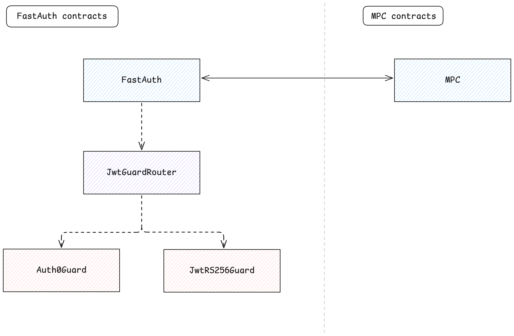

# Architecture

Some contracts can be classified into the following categories:

- `Guard` - A middleware contract that checks if the request is authenticated.
- `GuardRouter` - A contract that routes the request to the appropriate guard contract.

The following diagram shows the architecture of the contracts and how they interact with the MPC:

The architecture is composed of the following contracts:

- [FastAuth](./architecture_contracts_fa.md) - The main contract. It acts as the gateway to perform signatures via [MPC](./architecture_mpc.md). Accessible to the end-user.
- [JwtGuardRouter](./architecture_contracts_jwt-guard-router.md) - A contract that routes JWT verification requests to the appropriate guard contract.
- [Auth0Guard](./architecture_contracts_auth0-guard.md) - A guard contract that verifies a JWT token forged through Auth0.
