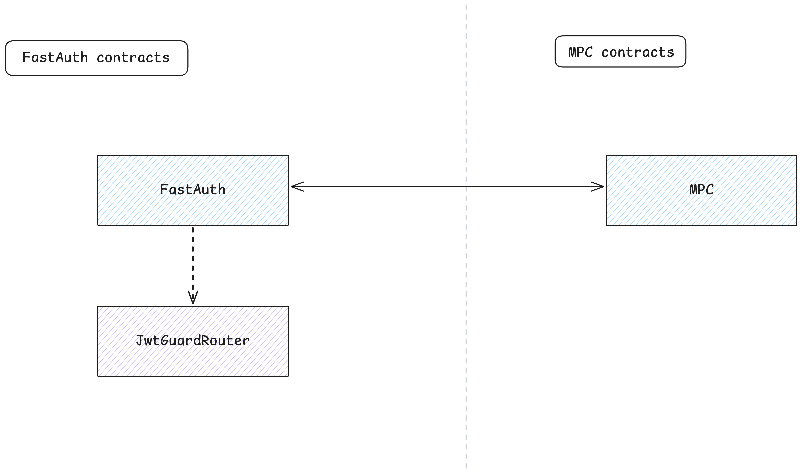

# FastAuth

The `FastAuth` contract is the main entry point for authentication and MPC-based signing in the FastAuth architecture. It manages guard contracts, verifies payloads, and coordinates the signing process via MPC.



## Features

- Owner-only access control for administrative functions, such as adding or removing guards and updating MPC settings.
- Maintains a mapping of guard IDs to their contract account IDs.
- Delegates verification and signing requests to the appropriate guard contract.
- Coordinates the full authentication and signing flow for end-users.

## Contract state

- `guards`: A mapping from guard IDs (`String`) to their contract `AccountId`.
- `owner`: The `AccountId` of the contract owner with administrative privileges.
- `mpc_address`: The `AccountId` of the MPC contract.
- `mpc_key_version`: The current MPC key version.
- `version`: The contract version string.

## Adding a guard

Only the contract owner can add a guard, each identified by a unique ID. The guard ID must not contain the `#` character.

```rust
pub fn add_guard(&mut self, guard_id: String, guard_address: AccountId)
```

- `guard_id`: The unique ID for the guard (must not contain `#`).
- `guard_address`: The account ID of the guard contract.

## Removing a guard

Only the contract owner can remove a guard:

```rust
pub fn remove_guard(&mut self, guard_id: String)
```

## Querying a guard

The contract exposes a function to query a guard by guard ID. The function returns the account ID of the guard contract. If the guard does not exist, the function will panic.

```rust
pub fn get_guard(&self, guard_id: String) -> AccountId
```

## Routing verification

When verifying a payload, the `FastAuth` contract will route the request to the appropriate guard contract. If the guard does not exist, the function will panic. Otherwise, it will return a promise that will be resolved when the verification is complete.

The function to verify a payload is:

```rust
pub fn verify(&self, guard_id: String, verify_payload: String, sign_payload: Vec<u8>) -> Promise
```

The function accepts three arguments:

- `guard_id`: The guard ID to use for verification.
- `verify_payload`: The payload to verify.
- `sign_payload`: The payload to sign.

## Signing

The contract also exposes a function to perform the full authentication and signing flow. The function will verify the payload using the specified guard and, if successful, will initiate the MPC signing process. An attached deposit is required to cover MPC costs.

```rust
#[payable]
pub fn sign(&mut self, guard_id: String, verify_payload: String, sign_payload: Vec<u8>) -> Promise
```
