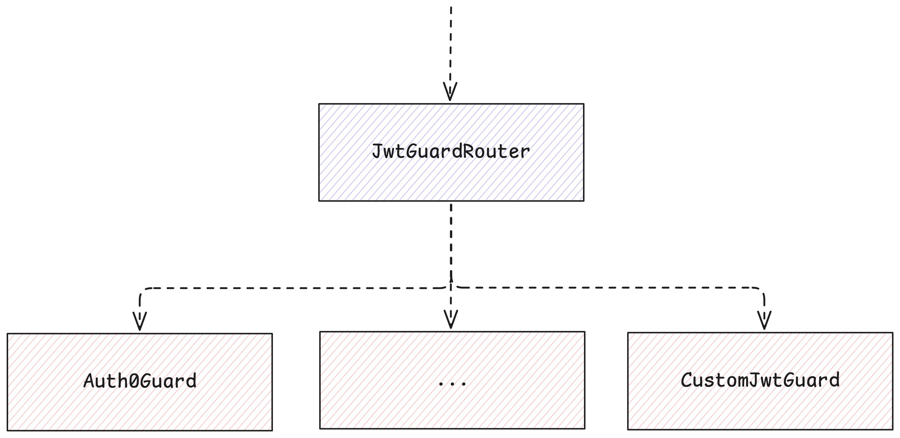

# JwtGuardRouter

The `JwtGuardRouter` contract acts as a registry and router for multiple JWT guard contracts, enabling flexible authentication methods via JWT. It allows the addition and querying of different guard contracts, each responsible for verifying JWT tokens according to their own logic. The router delegates verification requests to the appropriate guard based on the provided guard name.



## Features

- Owner-only access control for administrative functions, such as removing guards.
- Maintains a mapping of guard names to their corresponding guard contract account IDs.
- Delegates JWT verification to the specified guard contract.
- Supports dynamic addition of new guard contracts to extend authentication methods.

## Contract state

- `guards`: A mapping from guard names (`String`) to their contract `AccountId`.
- `owner`: The `AccountId` of the contract owner with administrative privileges.

## Adding a guard

Everyone can add a guard, each identified by a unique name. Adding a guard requires an attached deposit to cover storage costs plus a contingency deposit to prevent spam or small deposit attacks. The guard name must not contain the `#` character and must not exceed a maximum length.

:::info
The deposit is calculated as:

```
env::storage_byte_cost() * (GUARD_NAME_MAX_BYTES_LENGTH + MAX_ACCOUNT_BYTES_LENGTH) + CONTINGENCY_DEPOSIT
```

:::

Where the values of each constant are:

| Constant                      | Value        |
| ----------------------------- | ------------ |
| `GUARD_NAME_MAX_BYTES_LENGTH` | 2048 (bytes) |
| `MAX_ACCOUNT_BYTES_LENGTH`    | 64 (bytes)   |
| `CONTINGENCY_DEPOSIT`         | 1 (1 NEAR)   |

The function to add a guard is:

```rust
#[payable]
pub fn add_guard(&mut self, guard_name: String, guard_account: AccountId)
```

- `guard_name`: The unique name for the guard (must not contain `#`).
- `guard_account`: The account ID of the guard contract.

## Removing a guard

Unlike adding a guard, the removing guard capability is only available to the **owner** of the contract. The function to remove a guard is:

```rust
pub fn remove_guard(&mut self, guard_name: String)
```

## Querying a guard

The contract also exposes a function to query a guard by guard name:

```rust
pub fn get_guard(&self, guard_name: String) -> AccountId
```

The function returns the account ID of the guard contract.

## Routing verification

The `JwtGuardRouter` contract is responsible for routing the verification request to the appropriate guard contract. If the guard does not exist, the function will return an error. Otherwise, it will return a promise that will be resolved when the verification is complete.

The function to verify a JWT is:

```rust
pub fn verify(&self, guard_id: String, verify_payload: String, sign_payload: Vec<u8>) -> Promise
```

The function accepts three arguments:

- `guard_id`: The guard name to verify the JWT token.
- `verify_payload`: The payload to verify.
- `sign_payload`: The payload to sign.
