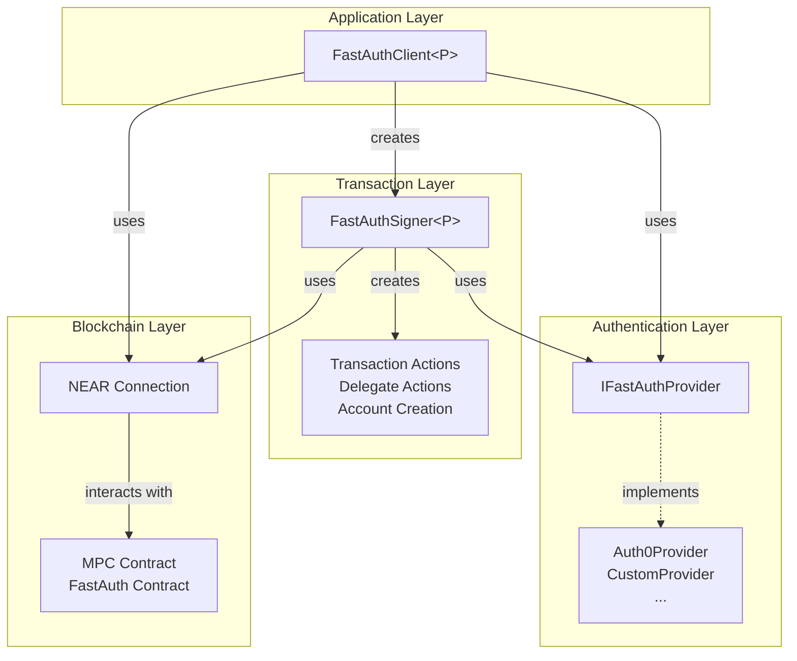

# Concepts

The FastAuth Browser SDK is designed with a modular architecture that separates concerns between authentication, signing, and blockchain interactions. This section provides a high-level overview of the core components and their relationships.

## Architecture Overview

## Core Components

### FastAuthClient

The **FastAuthClient** is the main orchestrator and entry point for the SDK. It provides a unified interface for authentication and transaction operations.

**Key Responsibilities:**

- Manages the authentication lifecycle (login/logout)
- Creates and configures signer instances
- Abstracts provider-specific implementations
- Enforces authentication requirements before transaction operations

### FastAuthProvider

The **FastAuthProvider** interface defines the contract for authentication providers. This abstraction allows the SDK to support multiple authentication backends.

**Key Capabilities:**

- Authentication state management (`isLoggedIn()`)
- Login/logout operations
- Transaction signature requests
- Cryptographic path derivation

**Provider Types:**

- **Auth0Provider**: Integration with Auth0 authentication service
- **CustomProvider**: Support for custom authentication backends

### FastAuthSigner

The **FastAuthSigner** handles all transaction-related operations and blockchain interactions. It bridges the authentication layer with NEAR blockchain functionality.

**Key Features:**

- Transaction signing and submission
- Account creation operations
- Delegate action handling
- Public key derivation from MPC contracts

**Transaction Types:**

- Standard NEAR transactions
- Delegate actions for gasless transactions
- Account creation with public key registration

### NEAR Connection

The **NEAR Connection** (from `near-api-js`) provides the blockchain connectivity layer.

**Responsibilities:**

- Network communication with NEAR blockchain
- Contract method calls and queries
- Transaction broadcasting
- Block and state queries

## Component Interactions

### Authentication Flow

1. **Client** receives login request from application
2. **Client** delegates to **Provider** for authentication
3. **Provider** handles authentication mechanism (OAuth, custom, etc.)
4. **Provider** maintains authentication state

### Transaction Flow

1. Application requests **Signer** from **Client**
2. **Client** verifies authentication status via **Provider**
3. **Client** creates and initializes **Signer** instance
4. **Signer** uses **Provider** for signature requests
5. **Signer** interacts with NEAR contracts via **Connection**

### Key Benefits

**Modularity**: Each component has a single responsibility, making the SDK maintainable and testable.

**Extensibility**: The provider pattern allows easy integration of new authentication mechanisms.

**Type Safety**: Generic types ensure compile-time validation across component interactions.

**Separation of Concerns**: Authentication, signing, and blockchain interactions are cleanly separated.

**Provider Abstraction**: Applications can switch authentication providers without changing business logic.

## Integration Points

### Smart Contracts

- **MPC Contract**: Handles multi-party computation for key derivation
- **FastAuth Contract**: Manages authentication and signature verification

### External Services

- **Authentication Providers**: Auth0, custom backends, identity providers
- **NEAR Network**: Mainnet, testnet, or custom networks
- **Browser APIs**: LocalStorage, SessionStorage for state persistence
