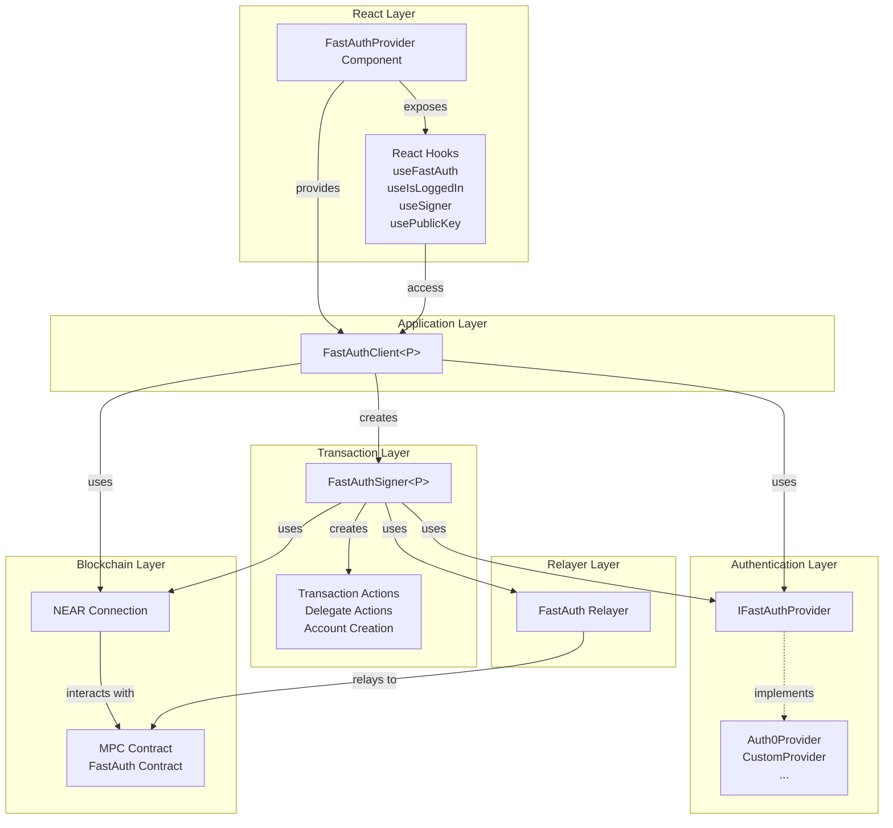

# Concepts

The FastAuth React SDK is designed with a modular architecture that separates concerns between authentication, signing, and blockchain interactions. This section provides a high-level overview of the core components and their relationships, including React-specific features like hooks and context providers.

## Architecture Overview



## Core Components

### FastAuthProvider Component

The **FastAuthProvider** is a React context provider component that wraps your application and manages the FastAuth client lifecycle.

**Key Responsibilities:**

- Initializes and manages the FastAuth client instance
- Provides client and ready state to child components via context
- Handles client lifecycle (creation, updates, cleanup)
- Supports optional React provider wrappers for auth providers

**Usage:**

```tsx
<FastAuthProvider
    providerConfig={{ provider: authProvider }}
    connection={connection}
    network="testnet"
>
    <YourApp />
</FastAuthProvider>
```

### FastAuthClient

The **FastAuthClient** is the main orchestrator and entry point for the SDK. It provides a unified interface for authentication and transaction operations.

**Key Responsibilities:**

- Manages the authentication lifecycle (login/logout)
- Checks authentication status (`isLoggedIn()`)
- Creates and configures signer instances with relayer support
- Abstracts provider-specific implementations
- Enforces authentication requirements before transaction operations
- Automatically configures contract addresses based on network selection

### FastAuthProvider

The **FastAuthProvider** interface defines the contract for authentication providers. This abstraction allows the SDK to support multiple authentication backends.

**Key Capabilities:**

- Authentication state management (`isLoggedIn()`)
- Login/logout operations
- Transaction signature requests
- Cryptographic path derivation

**Provider Types:**

- **Auth0Provider**: Integration with Auth0 authentication service
- **CustomProvider**: Support for custom authentication backends

### FastAuthSigner

The **FastAuthSigner** handles all transaction-related operations and blockchain interactions. It bridges the authentication layer with NEAR blockchain functionality and integrates with the FastAuth relayer service.

**Key Features:**

- Transaction signing and submission
- Simplified transaction flow with `signAndSendTransaction()`
- Gasless transactions with `signAndSendDelegateAction()`
- Account creation via relayer (returns transaction hash)
- Public key derivation from MPC contracts (supports multiple algorithms)
- Relayer integration for gasless operations

**Transaction Types:**

- Standard NEAR transactions
- Delegate actions for gasless transactions (via relayer)
- Account creation with public key registration (via relayer)

**Algorithms Supported:**

- `ed25519` (default)
- `secp256k1`

### React Hooks

The React SDK provides several hooks for convenient access to FastAuth functionality:

- **`useFastAuth`**: Access the FastAuth client and ready state
- **`useIsLoggedIn`**: Check login status with loading and error states
- **`useSigner`**: Get the FastAuth signer with automatic state management
- **`usePublicKey`**: Get the user's public key with automatic state management

**Benefits:**

- Automatic state management (loading, error states)
- Reactive updates when authentication state changes
- Type-safe with TypeScript generics
- Convenient error handling and refetch capabilities

### NEAR Connection

The **NEAR Connection** (from `near-api-js`) provides the blockchain connectivity layer.

**Responsibilities:**

- Network communication with NEAR blockchain
- Contract method calls and queries
- Transaction broadcasting
- Block and state queries

### FastAuth Relayer

The **FastAuth Relayer** service handles gasless transactions and simplified account creation.

**Responsibilities:**

- Relays transaction signature requests
- Relays delegate action signature requests
- Handles account creation transactions
- Pays gas fees on behalf of users

**Benefits:**

- Improved user experience (no gas fees)
- Simplified transaction flows
- Automatic transaction handling

## Component Interactions

### Authentication Flow

1. **Client** receives login request from application
2. **Client** delegates to **Provider** for authentication
3. **Provider** handles authentication mechanism (OAuth, custom, etc.)
4. **Provider** maintains authentication state

### Transaction Flow

1. Application uses **Hook** (e.g., `useSigner`) to get signer
2. **Hook** requests **Signer** from **Client**
3. **Client** verifies authentication status via **Provider**
4. **Client** creates and initializes **Signer** instance (with relayer)
5. **Signer** uses **Provider** for signature requests
6. **Signer** relays signature request to **Relayer** (for gasless transactions)
7. **Signer** interacts with NEAR contracts via **Connection** or **Relayer**

### React Component Flow

1. **FastAuthProvider** component initializes **Client** on mount
2. **Client** is exposed via React context
3. Components use **Hooks** to access client functionality
4. **Hooks** manage loading states and errors automatically
5. Components reactively update when authentication state changes

### Key Benefits

**Modularity**: Each component has a single responsibility, making the SDK maintainable and testable.

**Extensibility**: The provider pattern allows easy integration of new authentication mechanisms.

**Type Safety**: Generic types ensure compile-time validation across component interactions.

**Separation of Concerns**: Authentication, signing, and blockchain interactions are cleanly separated.

**Provider Abstraction**: Applications can switch authentication providers without changing business logic.

## Integration Points

### Smart Contracts

- **MPC Contract**: Handles multi-party computation for key derivation
- **FastAuth Contract**: Manages authentication and signature verification

### External Services

- **Authentication Providers**: Auth0, custom backends, identity providers
- **NEAR Network**: Mainnet, testnet (contracts auto-configured)
- **FastAuth Relayer**: Service for gasless transactions and account creation
- **Browser APIs**: LocalStorage, SessionStorage for state persistence (via providers)

### React-Specific Features

**Context Provider Pattern:**
- Single provider wraps entire application
- Client accessible throughout component tree
- Automatic lifecycle management

**Hook-Based API:**
- Declarative component integration
- Built-in state management
- Error handling and loading states
- Type-safe with generics

**Network Configuration:**
- Automatic contract address configuration
- Simple network selection ("mainnet" | "testnet")
- No manual contract ID management required
